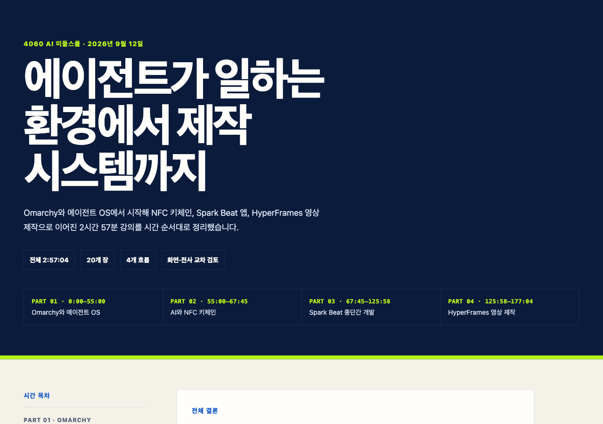

# 에이전트가 일하는 환경에서 제작 시스템까지

이 자료는 강경훈님이 공개하신 2026년 9월 12일 강의의 원문 HTML 노트를 그대로 보존한 것입니다.
Omarchy와 에이전트 OS에서 시작해 NFC 키체인, Spark Beat 앱, HyperFrames 영상 제작으로 이어지는 2시간 57분의 흐름을 시간 목차와 함께 살펴볼 수 있습니다.

## 먼저 잡아두면 좋은 핵심

- 에이전트는 답을 주는 도구에서 파일·터미널·브라우저를 실제로 다루는 작업 환경으로 넓어지고 있습니다.
- 아이디어를 앱으로 옮길 때는 코딩보다 계획, 승인, 실제 환경 검증, 독립 검토의 순서가 중요합니다.
- 한 번의 결과물보다 수정 규칙을 문서와 스킬로 남겨 다음 작업에 다시 쓰는 제작 체계가 오래 갑니다.

## 원문에서 볼 수 있는 네 가지 흐름

1. **Omarchy와 에이전트 OS** — 여러 에이전트가 상주하며 일하는 환경을 어떻게 바라볼지 살펴봅니다.
2. **AI와 NFC 키체인** — 아이디어, 3D 출력, NFC 삽입, 실패 진단이 하나의 물리적 결과물로 이어집니다.
3. **Spark Beat** — 웹 편집기, 데스크톱 운영 도구, 릴리스, 발표 자료를 하나의 제품 흐름으로 연결합니다.
4. **HyperFrames** — 원본 자산을 지키면서 레이어와 타임라인을 반복 가능한 영상 제작 규칙으로 바꿉니다.

  <a class="gallery-open" href="https://goodlookingprokim.github.io/4060-middle-school/static/kang-kyunghoon-gallery/ai-middle-school-2026-09-12-lecture-notes.html" target="_blank" rel="noopener">
    <strong>원문 전체 화면으로 보기</strong>
  </a>
  
  
전체 20개 장과 4개 흐름을 시간 순서대로 정리한 원문 웹 강의 노트입니다.

원문 출처: <a href="https://ai-middle-school-2026-09-12-lecture-notes.ezykang.chatgpt.site/" target="_blank" rel="noopener">4060 AI 미들스쿨 강의 노트</a> (블로그 밖 · 새 창)

> [!tip] 화면이 비어 보이면
> 전체 화면으로 열었는데 자료가 보이지 않을 때는 **새로고침을 한 번** 해주세요 (컴퓨터: F5 또는 Cmd+R, 휴대폰: 화면을 아래로 당기기). 블로그 글자가 잘 안 보일 때는 화면 위쪽의 해·달 버튼으로 라이트/다크 모드를 바꿔 보세요.
