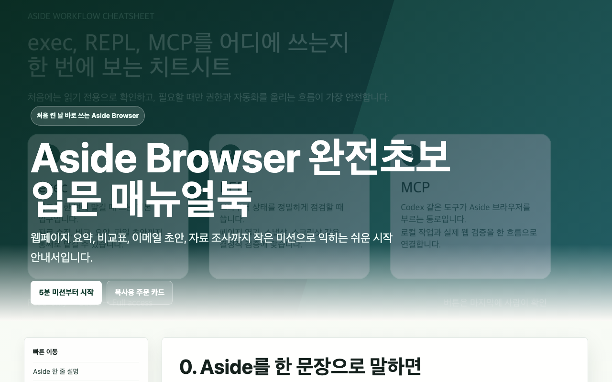

# Aside Browser 완전초보 입문 매뉴얼북

이 자료는 이상수님이 보내주신 원문 HTML 입문 매뉴얼을 그대로 보존한 것입니다.
만든 분이 의도한 화면 그대로 보실 수 있게 전체 화면으로 열립니다.

  <a class="gallery-open" href="https://goodlookingprokim.github.io/4060-middle-school/static/lee-sangsu-gallery/aside-browser-beginner-manual.html" target="_blank" rel="noopener">
    <strong>원문 전체 화면으로 보기</strong>
  </a>
  
  
웹페이지 요약, 비교표, 이메일 초안, 자료 조사까지 작은 미션으로 익히는 입문 안내서입니다. 첫날 5분 미션, 7일 연습 코스, 복사해서 바로 쓰는 주문 카드가 담겨 있습니다.

> [!tip] 화면이 비어 보이면
> 전체 화면으로 열었는데 자료가 보이지 않을 때는 **새로고침을 한 번** 해주세요 (컴퓨터: F5 또는 Cmd+R, 휴대폰: 화면을 아래로 당기기). 블로그 글자가 잘 안 보일 때는 화면 위쪽의 해·달 버튼으로 라이트/다크 모드를 바꿔 보세요.
