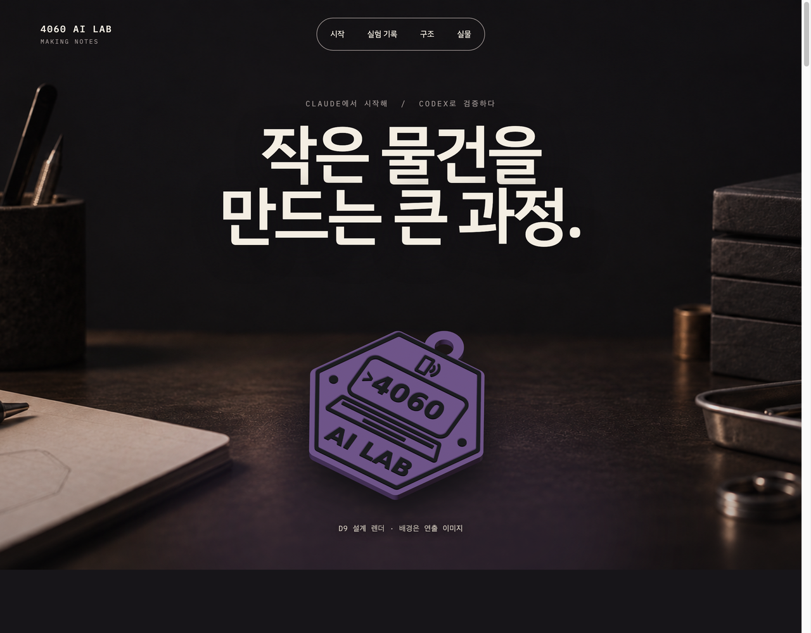

# 4060 AI LAB — 작은 물건을 만드는 큰 과정

이 자료는 이연호님이 공유해 주신 원문 HTML 웹 프레젠테이션을 그대로 보존한 것입니다.
설계 변경, 실제 출력에서 발견한 문제, NFC 삽입 구조, 완성품과 포장까지의 흐름을 한 번에 살펴볼 수 있습니다.

  <a class="gallery-open" href="https://goodlookingprokim.github.io/4060-middle-school/static/lee-yeonho-gallery/index.html" target="_blank" rel="noopener">
    <strong>원문 전체 화면으로 보기</strong>
  </a>
  
  
작은 NFC 키링을 만들며 Claude의 설계에서 Codex의 검증, 실제 출력과 조립·포장까지 이어진 과정을 기록한 자료입니다.

원문 출처: <a href="https://studio.valueflux.io/3dp/4060/" target="_blank" rel="noopener">ValueFlux 4060 AI LAB 웹 프레젠테이션</a> (블로그 밖 · 새 창)

> [!tip] 화면이 비어 보이면
> 전체 화면으로 열었는데 자료가 보이지 않을 때는 **새로고침을 한 번** 해주세요 (컴퓨터: F5 또는 Cmd+R, 휴대폰: 화면을 아래로 당기기). 블로그 글자가 잘 안 보일 때는 화면 위쪽의 해·달 버튼으로 라이트/다크 모드를 바꿔 보세요.
