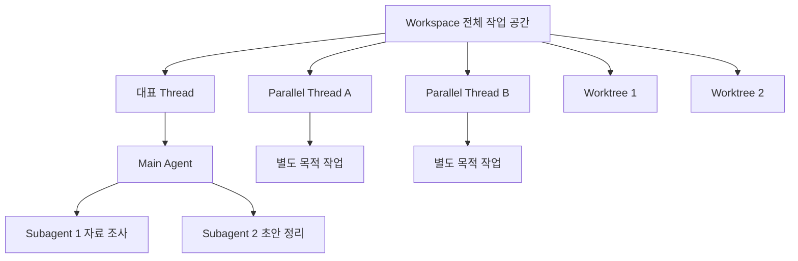

# 코덱스 스레드, 에이전트, 서브에이전트가 자꾸 헷갈릴 때 일상 비유로 이해하는 안내서

코덱스를 조금만 써보면 금방 이런 순간이 옵니다.

"스레드는 또 뭐고, 에이전트는 뭐고, 서브에이전트는 왜 또 따로 있지?"

처음엔 다 비슷해 보입니다. 다 같이 일을 하는 것 같고, 이름도 비슷하고, 화면에서는 더 헷갈립니다.

그런데 이걸 일상 비유로 바꿔서 보면 생각보다 금방 정리가 됩니다.

이 글에서는 어려운 설명보다, 실제 생활에서 자주 보는 장면으로 풀어보겠습니다. 가족회의, 집안 정리, 여행 계획, 보고서 작성 같은 익숙한 상황으로 생각하면 훨씬 편합니다.

## 먼저 한눈에 보는 용어표

| 용어 | 아주 짧게 말하면 | 일상 비유 |
| --- | --- | --- |
| `thread` | 한 줄로 이어지는 작업 대화 흐름 | 가족회의 한 회차 |
| `agent` | 실제로 일을 맡아 처리하는 담당자 | 회의를 진행하고 정리하는 실무자 |
| `subagent` | 메인 담당자를 돕는 보조 담당자 | 방 청소를 나눠 맡은 가족 구성원 |
| `parallel threads` | 서로 따로 굴러가는 여러 작업 줄기 | 여행 준비를 항공권, 숙소, 짐싸기로 따로 진행하는 것 |
| `worktree` | 같은 원본에서 갈라져 나온 별도 작업 폴더 | 같은 집 도면으로 각자 다른 방을 정리하는 임시 작업 공간 |
| `workspace` | 전체 작업이 이루어지는 큰 작업장 | 집 전체, 혹은 사무실 전체 |

핵심만 먼저 잡으면 이렇습니다.

- `workspace`는 전체 공간입니다.
- `thread`는 그 안에서 이어지는 대화 흐름입니다.
- `agent`는 실제로 일하는 담당자입니다.
- `subagent`는 메인 담당자를 돕는 보조 인력입니다.
- `parallel threads`는 일을 여러 갈래로 나눠 동시에 굴리는 방식입니다.
- `worktree`는 서로 부딪히지 않게 작업 자리를 나눠주는 장치입니다.

## 가족회의 비유로 먼저 이해해보면

가족여행을 준비한다고 해보겠습니다.

거실에 모여 이야기를 시작했습니다. 어디로 갈지, 누가 무엇을 맡을지, 언제 출발할지를 정합니다. 이 한 번의 대화 흐름이 `thread`입니다.

그 회의를 주도하면서 메모하고, 필요한 정보를 찾아보고, 다음 순서를 잡는 사람이 `agent`입니다.

그런데 일이 많아졌습니다.

- 한 사람은 숙소만 찾아보고
- 한 사람은 KTX 시간표만 보고
- 한 사람은 준비물 목록만 정리합니다

이렇게 따로 나뉘어 잠깐씩 맡아 도와주는 존재가 `subagent`라고 생각하면 쉽습니다.

중요한 점은, 이 보조 담당자들이 아무 데서나 제멋대로 움직이는 게 아니라는 점입니다. 보통은 메인 담당자가 방향을 주고, 필요한 일만 나눠 맡깁니다.

## 집안 청소 비유로 보면 서브에이전트가 왜 필요한지 보입니다

주말에 집안 대청소를 한다고 해보겠습니다.

혼자 다 하려면 이렇게 됩니다.

- 거실 치우다가
- 주방 설거지 생각나고
- 베란다 정리도 눈에 띄고
- 세탁기 돌리는 것도 잊지 말아야 합니다

이렇게 한 사람이 모든 걸 붙들고 있으면 자꾸 흐름이 끊깁니다.

그래서 역할을 나눕니다.

- 한 사람은 거실
- 한 사람은 주방
- 한 사람은 빨래

이게 바로 서브에이전트를 쓰는 감각과 비슷합니다.

메인 담당자는 전체 진행을 놓치지 않고, 각 보조 담당자는 자기 범위만 빠르게 처리합니다.

즉, 서브에이전트는 "새 프로젝트 하나를 따로 여는 것"보다는 "지금 하던 일 안에서 일부를 분담시키는 것"에 가깝습니다.

## 여행 계획 비유로 보면 병렬 스레드가 왜 다른지 보입니다

여행 준비는 한 줄로만 하면 종종 답답합니다.

- 항공권 비교
- 숙소 후보 정리
- 현지 맛집 조사
- 짐 목록 점검

이걸 한 대화 안에서 계속 왔다 갔다 하면 금방 복잡해집니다.

이럴 때는 `parallel threads`가 잘 맞습니다. 일의 줄기를 아예 따로 빼는 겁니다.

예를 들면,

- A 스레드: 항공권만 비교
- B 스레드: 숙소만 비교
- C 스레드: 일정표만 작성

이렇게 나누면 각각의 대화가 덜 엉키고, 기록도 깔끔하게 남습니다.

여기서 서브에이전트와 차이가 생깁니다.

- 서브에이전트는 메인 흐름 안에서 잠깐 맡겨 처리하는 느낌
- 병렬 스레드는 작업 흐름 자체를 옆으로 따로 분리하는 느낌

## 보고서 작성 비유로 보면 worktree가 왜 필요한지 이해됩니다

이번에는 보고서를 쓴다고 해보겠습니다.

하나는 발표용 짧은 버전, 다른 하나는 상세한 내부 보고용 긴 버전이 필요합니다.

둘 다 같은 원자료를 쓰지만, 서로 다른 방향으로 많이 수정될 수 있습니다.

이럴 때 한 문서 파일에서 계속 덮어쓰면 헷갈리기 쉽습니다. 그래서 복사본을 따로 만들어 각자 작업하곤 하죠.

`worktree`는 바로 그런 감각입니다.

같은 프로젝트를 바탕으로 하지만, 실제 작업 폴더를 따로 만들어서 서로 충돌을 줄여줍니다. 한쪽에서는 실험적인 수정을 하고, 다른 쪽에서는 안정적인 버전을 유지할 수 있습니다.

쉽게 말하면 이렇습니다.

- `workspace`는 "우리 사무실 전체"
- `worktree`는 "이번 작업만 하려고 따로 펼쳐놓은 책상"

## 흐름을 그림으로 보면 더 단순합니다



## 병렬 스레드와 서브에이전트는 무엇이 다를까

이 둘이 제일 많이 헷갈립니다. 둘 다 "동시에 뭔가 나눠서 한다"는 점이 비슷하기 때문입니다.

| 항목 | 병렬 스레드 | 서브에이전트 |
| --- | --- | --- |
| 기본 감각 | 작업 줄기를 따로 분리 | 같은 줄기 안에서 일부 업무 위임 |
| 기록 방식 | 대화 기록이 서로 독립적 | 메인 흐름에 종속적 |
| 잘 맞는 일 | 주제가 분명히 다른 작업 | 지금 하던 일의 하위 작업 |
| 장점 | 맥락이 덜 섞임 | 메인 담당자가 통제하기 쉬움 |
| 주의점 | 나중에 합칠 때 정리가 필요 | 너무 많이 쓰면 누가 뭘 하는지 헷갈림 |
| 비유 | 여행 준비를 항공권, 숙소, 일정으로 나눈 것 | 집안 청소를 방마다 나눠 맡긴 것 |

짧게 구분하면 이렇습니다.

- "아예 다른 갈래로 굴릴 일"이면 병렬 스레드
- "지금 하던 일 중 일부를 맡길 일"이면 서브에이전트

## 실제로 언제 무엇을 쓰면 좋을까

아래 표는 실전에서 가장 많이 쓰는 판단 기준입니다.

| 상황 | 추천 방식 | 이유 |
| --- | --- | --- |
| 블로그 글 하나를 함께 다듬는 중 | 대표 스레드 하나 유지 | 맥락이 이어져야 하기 때문 |
| 글 초안 쓰는 동안 자료조사만 잠깐 맡기고 싶을 때 | 서브에이전트 | 메인 흐름을 끊지 않고 분담 가능 |
| 발표 자료와 공지문을 동시에 준비할 때 | 병렬 스레드 | 목적과 결과물이 다름 |
| 안전한 버전은 유지하고 과감한 실험도 해보고 싶을 때 | worktree | 파일 충돌과 덮어쓰기를 줄임 |
| 같은 프로젝트 안에서 역할만 나눠 빠르게 처리하고 싶을 때 | 서브에이전트 | 메인 담당자가 결과를 모으기 쉬움 |
| 완전히 다른 작업 주제를 동시에 관리할 때 | 병렬 스레드 | 대화 기록이 섞이지 않음 |

## 대표 스레드를 먼저 하나 정해두면 편합니다

여기서 많은 분들이 처음부터 너무 복잡하게 시작합니다.

처음부터 스레드를 여러 개 열고, 에이전트를 나누고, 워크트리까지 만들면 오히려 정신이 더 없습니다.

보통은 `대표 스레드` 하나를 먼저 정해두는 게 좋습니다.

대표 스레드는 쉽게 말해 "총괄 회의실"입니다.

- 지금 무슨 작업을 하는지
- 누가 무엇을 맡았는지
- 어느 결과를 최종본으로 볼지

이 기준을 대표 스레드에 모아두면 나중에 덜 헷갈립니다.

아래 문장은 그대로 복사해서 시작점으로 써도 됩니다.

```text
이번 작업의 대표 스레드로 진행하겠습니다.
목표는 [원하는 결과]입니다.
이 스레드에서는 전체 방향, 우선순위, 최종 판단을 관리해 주세요.
세부 조사나 임시 작업이 필요하면 따로 나누되, 다시 이 대표 스레드에 짧게 합쳐서 보고해 주세요.
현재 작업 공간은 [workspace 또는 폴더 이름]이고, 오늘 먼저 끝낼 일은 [첫 번째 목표]입니다.
```

## 자주 하는 실수와 고치는 방법

처음 쓰는 분들이 자주 겪는 문제는 크게 비슷합니다.

| 자주 하는 실수 | 왜 꼬이나 | 이렇게 고치면 됨 |
| --- | --- | --- |
| 스레드를 너무 많이 한꺼번에 엶 | 어디가 기준인지 잊어버림 | 대표 스레드 하나를 먼저 정함 |
| 서브에이전트에게 너무 큰 일을 맡김 | 메인 흐름과 분리되어 통제가 어려움 | 작고 분명한 일만 맡김 |
| 병렬 스레드인데 중간 정리를 안 함 | 나중에 합칠 때 중복과 충돌이 생김 | 중간 요약을 대표 스레드에 모음 |
| worktree 없이 큰 실험을 함 | 파일이 뒤섞이고 되돌리기 어려움 | 실험성 작업은 별도 worktree 사용 |
| workspace 개념 없이 폴더를 옮겨 다님 | 어느 파일이 기준본인지 헷갈림 | 현재 작업 공간과 기준 폴더를 먼저 확인 |
| 에이전트에게 목표보다 방법을 너무 많이 고정함 | 쓸데없이 답답해짐 | 목표와 제한만 주고 세부 실행은 맡김 |

조금 더 현실적으로 말하면 이렇습니다.

- 청소를 시키는데 "집 깨끗하게 해줘"라고만 하면 막막합니다.
- 반대로 "걸레질 17번, 책 3cm 간격, 쿠션 각도 12도"처럼 너무 세세하면 오히려 느려집니다.

적당한 지시가 중요합니다.

## 다시 쓸 때 확인하면 좋은 체크리스트

다음 작업에서도 비슷한 구조를 쓰고 싶다면 아래만 먼저 점검해도 훨씬 수월합니다.

- 지금 이 일이 대표 스레드 하나로 충분한가
- 다른 갈래로 완전히 분리할 일이 있는가
- 메인 흐름 안에서 잠깐 위임할 일만 있는가
- 파일 충돌 위험이 크면 worktree가 필요한가
- 결과를 다시 모을 기준 스레드가 정해져 있는가
- 지금 작업하는 workspace가 어디인지 모두가 같은 기준으로 알고 있는가
- 최종본이 무엇인지 한 문장으로 말할 수 있는가

이 체크리스트를 보면 결국 한 가지로 모입니다.

일을 나누는 목적은 복잡하게 보이기 위해서가 아니라, 덜 헷갈리고 덜 꼬이기 위해서입니다.

## 아주 짧게 정리하면

코덱스의 `thread`, `agent`, `subagent`, `parallel threads`, `worktree`, `workspace`는 어려운 기술 용어처럼 보여도, 일상에서는 이미 우리가 자주 하던 일과 크게 다르지 않습니다.

- 회의 흐름은 스레드
- 일을 맡는 사람은 에이전트
- 옆에서 일부를 나눠 맡는 사람은 서브에이전트
- 아예 다른 갈래로 굴리는 일은 병렬 스레드
- 따로 펼쳐놓은 작업 자리는 워크트리
- 전체 작업장이 워크스페이스

처음에는 대표 스레드 하나만 잘 세우고 시작해도 충분합니다. 그 다음에 일이 많아질 때 서브에이전트와 병렬 스레드를 나누고, 파일 충돌이 걱정될 때 worktree를 붙이면 됩니다.

어렵게 외우기보다, "이건 가족회의냐, 집안일 분담이냐, 여행 준비 분리냐, 보고서 복사본 작업이냐" 정도로 떠올리면 훨씬 오래 남습니다.
